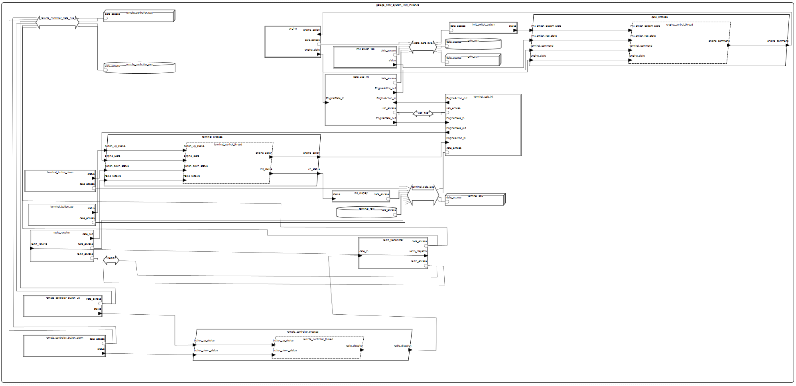

# Sterowanie bramą wjazdową

## Opis projektu
Tematem projektu jest system do sterowania bramą wjazdową w garażu podziemnym.
Brama wjazdowa zbudowana z segmentów podnosi się do góry po łukowatych prowadnicach i zatrzymuje na suficie,
a następnie opuszcza w dół po tym samym torze. Do sterowania bramą wykorzystywany jest
terminal umieszczony na ścianie obok oraz pilot do zdalnego sterowania.

## Opis dla użytkownika
Użytkownik posiada pilot z jednym przyciskiem. Po zbliżeniu się odpowiednio blisko do bramy,
naciska przycisk, a brama się otwiera. Użytkownik wchodzi/wjeżdża do środka, a następnie ponownie
wciska przycisk, a brama się zamyka. Alternatywnie po wejsciu/wjechaniu do garażu podchodzi do terminalu
i naciska przycisk, co również opuszcza bramę. Wciśnięcie przycisku podczas procesu opuszczania/podnoszenia
bramy skutkuje przerwaniem operacji i zatrzymaniem bramy w miejscu.

## Rysunek koncepcyjny

## Diagram modelu

## Spis komponentów AADL
 
### Urządzenia

- **usb_interface_device**
  Interfejs usb

- **engine_device**  
  Silnik, odbiera akcje i raportuje swój stan.

- **limit_switch_device**  
  Przełącznik krańcowy (górny i dolny).

- **button_device**  
  Przycisk (up/down) dla terminala i pilota.

- **lcd_display_device**  
  Wyświetlacz LCD, pokazuje stan silnika.

- **radio_receiver**  
  Odbiornik sygnału radiowego

- **radio_transmitter**  
  Transmiter sygnału radiowego

### Wątki

- **engine_control_thread**  
  Wątek kontrolera silnika, podejmuje decyzje na podstawie przełączników i komend.

- **terminal_control_thread**  
  Wątek sterujący terminalem

- **remote_controller_thread**  
  Wątek sterujący pilotem

### Procesy

- **gate_process**  
  Proces bramy obsługuje silnik, przełączniki i interfejs usb.

- **terminal_process**  
  Proces terminala, obsługuje przycisk, wyświetlacz LCD, odbiornik radiowy i interfejsc usb.

- **remote_controller_process**  
  Proces pilota zdalnego, obsługuje przyciski i nadajnik radiowy.

### Magistrale

- **radio**  
  Magistrala reprezentująca komunikację radiową

- **data_bus**  
  Magistrala reprezentująca komunikację między komponentami w ramach jednego modułu

- **usb_bus**  
  Magistrala reprezentująca komunikację między modułami za pomocą interfejsu usb

### Procesory

- **cpu**  
  Reprezentuje procesor o architekturze ARM

### Pamięć

- **ram**  
  Reprezentuje pamięć ram

### Typy danych

- **EngineState** (running, idle)  
  Stan pracy silnika.

- **EngineAction** (up, down, stop)  
  Komendy sterujące silnikiem.

### System

- **garage_door_system**  
  Zawiera wszystkie komponenty i definiuje połączenia między nimi

## Analiza

### Check Binding Constraints
Nie wykazała żadnych problemów

### Check Connection Binding Consistency
Nie wykazała żadnych błędów ani ostrzeżeń

### Analyse Bus Load

"Physical Bus","Capacity (KB/s)","Budget (KB/s)","Required Budget (KB/s)","Actual (KB/s)"  
"radio","3750.0","625.0","0.0","0.08"  
"usb_bus","3750.0","625.0","0.0","0.5333333333333334"  
"gate_data_bus","3750.0","625.0","0.0","2.066666666666667"  
"terminal_data_bus","3750.0","625.0","0.0","0.7466666666666668"  
"remote_controller_data_bus","3750.0","625.0","0.0","0.2"  

### Analyse Resource Allocations (Bound)

Processor gate_cpu: Total MIPS 0,500 MIPS of bound tasks within MIPS capacity 1,100 MIPS of gate_cpu  
Processor terminal_cpu: Total MIPS 0,400 MIPS of bound tasks within MIPS capacity 1,100 MIPS of terminal_cpu  
Processor remote_controller_cpu: Total MIPS 0,300 MIPS of bound tasks within MIPS capacity 1,100 MIPS of remote_controller_cpu  

### Calculate Weight Totals

usb_bus: [L] Sum of weights / gross weight is 0,200 kg (no limit specified)  
gate_data_bus: [L] Sum of weights / gross weight is 0,500 kg (no limit specified)  
terminal_data_bus: [L] Sum of weights / gross weight is 0,500 kg (no limit specified)  
remote_controller_data_bus: [L] Sum of weights / gross weight is 0,500 kg (no limit specified)  
engine: [L] Sum of weights / gross weight is 30,000 kg (no limit specified)  
limit_switch_top: [L] Sum of weights / gross weight is 0,070 kg (no limit specified)  
limit_switch_bottom: [L] Sum of weights / gross weight is 0,070 kg (no limit specified)  
gate_usb_int: [L] Sum of weights / gross weight is 0,100 kg (no limit specified)  
terminal_button_up: [L] Sum of weights / gross weight is 0,020 kg (no limit specified)  
terminal_button_down: [L] Sum of weights / gross weight is 0,020 kg (no limit specified)  
lcd_display: [L] Sum of weights / gross weight is 0,020 kg (no limit specified)  
radio_receiver: [L] Sum of weights / gross weight is 0,020 kg (no limit specified)  
terminal_usb_int: [L] Sum of weights / gross weight is 0,100 kg (no limit specified)  
remote_controller_button_up: [L] Sum of weights / gross weight is 0,020 kg (no limit specified)  
remote_controller_button_down: [L] Sum of weights / gross weight is 0,020 kg (no limit specified)  
radio_transmitter: [L] Sum of weights / gross weight is 0,020 kg (no limit specified)  
gate_ram: [L] Sum of weights / gross weight is 0,050 kg (no limit specified)  
terminal_ram: [L] Sum of weights / gross weight is 0,050 kg (no limit specified)  
remote_controller_ram: [L] Sum of weights / gross weight is 0,050 kg (no limit specified)  
gate_cpu: [L] Sum of weights / gross weight is 0,050 kg (no limit specified)  
terminal_cpu: [L] Sum of weights / gross weight is 0,050 kg (no limit specified)  
remote_controller_cpu: [L] Sum of weights / gross weight is 0,050 kg (no limit specified)  
garage_door_system_impl_Instance: [A] Sum of weights (32,480 kg) is below weight limit of 50,000 kg (35,0 % Weight slack)  

## Autor
Jakub Frączek
## Adres email
 jakubfraczek@student.agh.edu.pl
